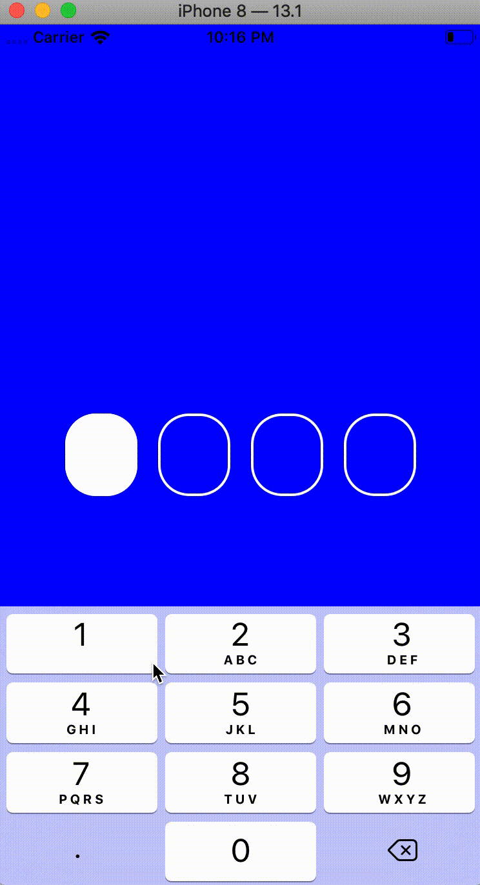

# PINTextFieldView

PINTextFieldView is a library used for accepting pincodes.

## Example

To run the example project, clone the repo, and run `pod install` from the Example directory first.

# Installation

## CocoaPods

PINTextFieldView is available through [CocoaPods](https://cocoapods.org). To install
it, simply add the following line to your Podfile:

```ruby
pod 'PINTextFieldView'
```

## Manually
Copy the source files PINTextFieldView, PINTextField and PINMasker into your project.

# Usage
PINTextFieldView is an UIView. So, you can use it as any other UIView.

You can configure the quantity of pin codes, font, background colors, text colors, and the size of the PINTextFieldView, as you can see below.


* **widthPIN**: The width of each one of the PINs
* **heightPIN**: The height of each one of the PINs
* **spacement:**: The spacement between each one of the PINs
* **font**: The font of each one of the PINs
* **cornerRadiusPIN**: The corner radius of each one of the PINs
* **borderWidthPIN**: The border width of each one of the PINs
* **borderColorPIN**: The border color of each one of the PINs
* **backgroundColorEmptyPIN**: The background color of a PIN when it's empty and not selected
* **backgroundColorFilledPIN**: The background color of a PIN when it's filled and not selected
* **backgroundColorSelectedPIN**: The background color of a PIN when it's selected
* **textColorSelectedPIN**: The text color of the text of a PIN when it's selected
* **textColorUnselectedPIN**: The text color of the text of a PIN when it's unselected

There is a delegate for PINTextFieldView. It is used to be warned when the last code was just typed and all the others fields were filled. The delegates needs to implements the protocol PINTextFieldViewProtocol. It has just one function:

```swift
func didFinish(values: [Int])
```

Moreover, It is possible to get all codes any time. The function for that is:

```swift
func allPINCodes() -> [Int]
```

In both functions, the values are the codes in the order it appears.

**NOTE:**: In PINTextFieldView the function becomeFirstResponder was overriden to call becomeFirstResponder to the first code text field.

# Screenshots


## Author

Roberto Sampaio, ssampaio.roberto@gmail.com

## License

PINTextFieldView is available under the MIT license. See the LICENSE file for more info.
